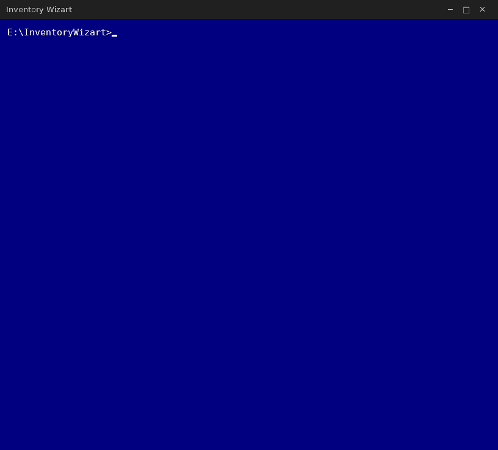

<p align="center">
  
</p>
<br>

  > A Portable IT Asset Toolkit For **Windows**.
  > Drop one file on a USB stick and run it on each machine. Move with the
  > arrow keys, Enter to run the highlighted collector. Three collectors, one
  > file, everything written out as CSV that loads straight into Excel or your
  > own scripts. Each collector returns to the menu when it finishes, so one
  > visit to a PC can produce all three sets of files.

```
     [x]  PC & Monitors         system, BIOS, OS, network, monitors
     [ ]  Printers              every online printer, merged site-wide
     [ ]  RAM & HDD Upgrates    memory, drive bays, Windows 11 readiness

     [ ]  Exit

  ─────────────────────────────────────────────────────────────────────────
```

- `InventoryWizart.command` is the macOS build and covers option 1 only —
  printers and upgrade paths are read from WMI, which macOS does not have.

<br>

---

### [1] PC & Monitors

  > Hardware, OS, network, and every connected monitor including serial numbers.
  > Two files that share the `ComputerName` column, so monitors match back to
  > their PC. Re-running on the same machine just refreshes its own files.

HOSTNAME_Specs.csv

```
"ComputerName",  "Manufacturer",  "Model",  "SerialNumber",  "AssignedTo",  "IPAddress",  "MACAddress", 
"OperatingSystem",  "OSVersion",  "CPU",  "RAM(GB)",  "Storage(GB)",  "MonitorCount",  "CollectedOn"
```

HOSTNAME_Monitors.csv

```
"ComputerName", "AssignedTo", "MonitorNumber", "Manufacturer", "Model", "Serial", "Year", "CollectedOn"
```

- macOS monitor serials/year are often *not* exposed by the OS. The model name is reliable; "Serial" and "Year" may be blank.
- "RAM(GB)" is reported as a whole number, snapped to the real installed size, so a 16 GB PC reads `16` and not `15.9`.

<br>

---

### [2] Printers

  > Every printer that is **connected and online**, as one row per *physical
  > printer* rather than per PC. One file for the whole site: the first run
  > creates it, every run after that merges into the same file. An office with
  > ten PCs and three shared printers ends up with three rows.

Company_Printers.csv

```
"ComputerName", "Manufacturer", "Model", "Features", "Colour", "Condition",
"SerialNumber", "AssetTag", "Location", "AssignedTo", "IPAddress", "MACAddress",
"PrinterName", "Connection", "Port", "Driver", "IsDefault", "Shared",
"PageCount", "Supplies", "ConditionNote", "OnlineVia", "CollectedOn"
```

- Printers are matched on serial number, then MAC, then IP + model, then queue
  name. A printer already listed is not added again — its `ComputerName` column
  just gains the extra PC, and any column that was blank before is filled in if
  this PC managed to read it.
- PDF/XPS/OneNote/Fax writers and Remote Desktop redirected queues are skipped,
  as are queues the spooler has marked offline or that fail a live reachability test.
- Serial numbers, IP and MAC addresses are read from every source Windows
  exposes: the port configuration, the WSD device record, the USB PnP tree, the
  ARP table, and SNMP (UDP 161, communities `public`/`private`), including the
  per-vendor serial OIDs. A printer with SNMP switched off and no local port
  address can still come back blank in those columns — that is expected, not a failure.

<br>

---

### [3] RAM & HDD Upgrates

  > Answers *"what can we upgrade in this box?"* without opening the case:
  > memory headroom, drive bays, and whether the machine can take Windows 11 —
  > so a box that is not worth parts is visible before the parts are ordered.
  > This PC only.

HOSTNAME_Upgrate.csv — one row per PC

```
"ComputerName", "Manufacturer", "Model", "SerialNumber", "BoardManufacturer", "BoardProduct",
"ChassisType", "ChassisCodes", "OperatingSystem", "OSVersion", "OSArchitecture", "CPU", "CPUCores",
"MemorySlotsTotal", "MemorySlotsUsed", "MemorySlotsFree", "InstalledRAM(GB)", "MaxSupportedRAM(GB)",
"Headroom(GB)", "MaxPerSlot(GB)", "MemoryType", "FormFactor", "RatedSpeed(MT/s)",
"ConfiguredSpeed(MT/s)", "MixedModules", "DrivesInternal", "OpticalDrives", "EstimatedDriveBays",
"EstimatedFreeBays", "HasHDD", "HasNVMe", "SystemDisk(GB)", "SmartFailingDrives",
"StorageUpgradePath", "TPMVersion", "SecureBoot", "BootMode", "SystemDiskPartitionStyle",
"CPUGenerationCheck", "Win11Ready", "Win11Notes", "Notes", "CollectedOn"
```

One row, one file, so a whole site collates into a single list. The per-slot and
per-drive detail is printed to the screen while you are standing at the machine
but is not written out.

**Memory**

- `MaxSupportedRAM(GB)` comes from SMBIOS and **some OEM BIOSes lie about it**. The
  `Notes` column flags the obvious cases (max reported at or below what is already
  installed, or nothing reported at all). `BoardProduct` and `SerialNumber` are in
  the CSV so the number can be checked against the vendor spec for that service tag.
- WMI only reports *populated* memory devices, so an empty slot is a count, not a
  locator name. The `Empty` rows in the on-screen slot table are derived from
  `MemorySlotsTotal - MemorySlotsUsed`; they show occupancy but cannot name the slot.
- Soldered memory on laptops can still report as a DIMM. A portable chassis with one
  device and no free slots is flagged in `Notes` — confirm before ordering parts.
- `PartNumber` is what you match when adding to an existing pair.

**Drives**

- **Firmware does not report drive bays.** `EstimatedDriveBays` is the published norm
  for the chassis type minus what is fitted, and every field derived from it says
  "estimate". Confirm by opening the case before ordering a caddy or a disk.
- `MediaType` (HDD/SSD) and `BusType` (SATA/NVMe/USB) come from `MSFT_PhysicalDisk`,
  which does not exist before Windows 8; there the model name and spindle speed are
  used instead and `MediaType` can read `Unknown`.
- `HasNVMe` = No is the hint that there may be a free M.2 slot. `HasHDD` = Yes is
  usually the cheapest change available.
- `SmartFailingDrives` counts drives whose SMART status predicts failure. It is a
  count for the whole machine, not per disk — a failure-predict instance cannot be
  matched back to a specific disk reliably. Reading it needs administrator; without
  that the column says `Not read` rather than `0`, which would be a clean bill of
  health nobody earned.
- `HasHDD` / `HasNVMe` read `Unknown`, not `No`, when the storage namespace is
  unavailable (pre-Windows 8) and the media type is only a guess from the model name.

**Windows 11**

- `TPMVersion` needs an elevated read. Without it the column says `Not detected` and
  `Win11Ready` drops to `Unknown` rather than `No` — run as administrator for a
  definite answer.
- `CPUGenerationCheck` is the Intel 8th gen / AMD Ryzen 2000 cut, not Microsoft's
  full supported-CPU list. Anything it does not recognise reads `Unknown` and says
  so in `Win11Notes` instead of guessing.
- `Win11Ready` is `Yes` only when every check passed, `No` when something hard-fails,
  and `Unknown` when a check could not be read. `Win11Notes` names each one.
- `BootMode` = Legacy and `SystemDiskPartitionStyle` = MBR are conversion work, not
  a wall — the machine can still take 11 after an MBR to GPT conversion.
